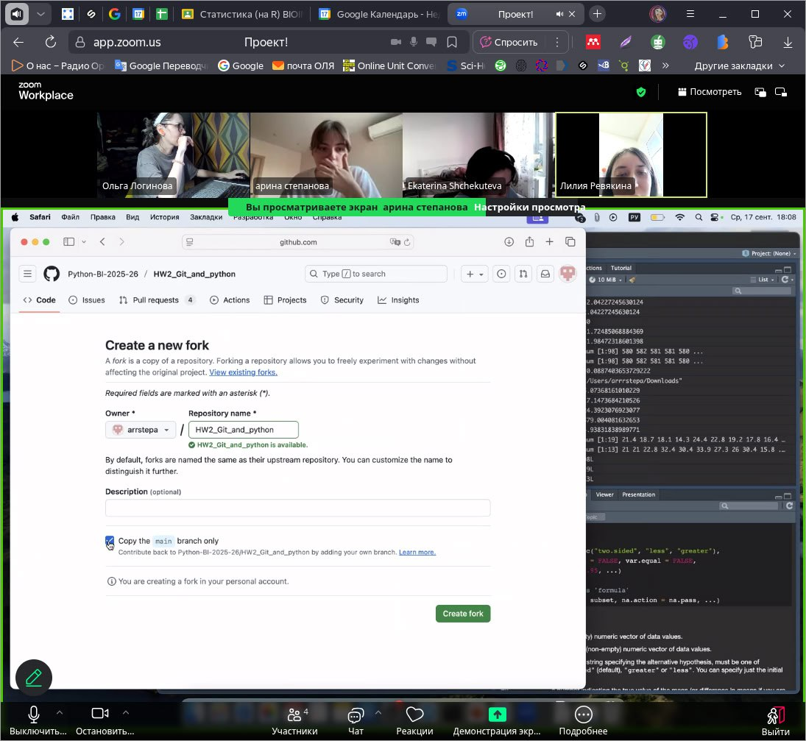

# About calculator

A calculator is a program that performs basic arithmetic operations: addition, subtraction, multiplication and division. The calculator takes as input ( ) a string with some mathematical expression and prints a number - the result of calculating this expression.

# Requirements

Python 3.x (tested on Python 3.8 and above).

# Team

Shchekuteva Ekaterina, Revyakina Lilia, Loginova Olga, Stepanova Arina.

# Citation

;) If you use calculator in your work, please cite [https://github.com/arrstepa/HW2_Stepanova].

# Feedback and bug reports

If you have any troubles running calculator, please attach params.txt and calculator.log :)

# Screenshot of the team meeting

